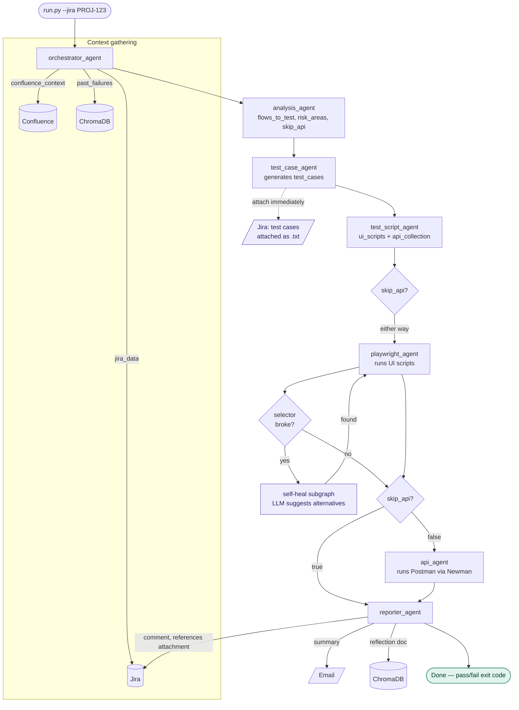

# QA Orchestrator

An agentic QA automation system built on LangGraph that reads a Jira
ticket, pulls module knowledge from Confluence, and generates test cases,
UI scripts, and API collections — with everything mocked locally until
real credentials are available.

## Why

Manual QA on a ticket typically takes 1–2 days and produces inconsistent
test coverage that depends on which engineer picks it up. This pipeline
turns that into a ~5 minute automated run: same standard every time,
regression + API coverage on every ticket, and selectors that self-heal
instead of silently rotting.

## How it works

1. **Orchestrator** reads the Jira ticket, resolves the module, pulls the
   matching Confluence page, and queries ChromaDB for past failures on
   that module.
2. **Analysis agent** turns that context into a prioritised list of flows
   to test, risk areas, and which user types are in scope.
3. **Test case agent** writes structured, human-readable test cases
   (happy path, negative, edge, API) — then immediately attaches them to
   the Jira ticket as a text file, so QA can review coverage while the
   rest of the pipeline is still running.
4. **Test script agent** turns those into executable code — Playwright UI
   scripts built on top of a *recorded* baseline (never hallucinated
   selectors) and Postman API collections built on top of the BE team's
   real collection.
5. **Playwright agent** runs the UI tests. If a selector breaks, an
   internal self-healing subgraph screenshots the DOM, asks the LLM for
   alternative selectors, and retries before giving up.
6. **API agent** runs the Postman collection via Newman (skipped for
   FE-only tickets).
7. **Reporter agent** posts a pass/fail summary to Jira and email —
   referencing the test case attachment posted in step 3 — and writes what
   it learned (failures, healed selectors, flaky patterns) back to
   ChromaDB for the next run.

All state passes between agents through a single shared `QAState` object —
no agent calls another agent directly, so each one is testable in
isolation and the state at any point is fully inspectable.

## Pipeline at a glance



Solid arrows are the `QAState` edges wired in `graph/graph_builder.py`;
the dashed arrow is a side effect (test_case_agent writes the attachment
directly via `tools/jira_client.py`, it isn't part of the graph). See
[docs/04_workflow.md](./docs/04_workflow.md) for the full sequence
diagram, self-healing detail, and timing breakdown.

## Mock vs. real

Every external dependency (Jira, Confluence, Playwright's browser
execution, Jira/email reporting) is mocked locally via files under
`mock_data/` when `USE_MOCK=true`. Flipping it to `false` and supplying
real credentials in `.env` is the only change needed to run against real
systems — no code changes. ChromaDB is always real; it runs locally with
no credentials required.

## Setup

```bash
python -m venv .venv
source .venv/bin/activate
pip install -r requirements.txt
playwright install chromium
cp .env.example .env   # defaults already work with no API key
python run.py --jira PROJ-123
```

With `USE_MOCK=true` and `USE_MOCK_LLM=true` (the defaults) the whole
pipeline — Jira, Confluence, the LLM, Playwright execution, Jira
attachments/comments, and email — runs against local files under
`mock_data/` with zero external credentials. Flip `USE_MOCK_LLM=false`
once a real `LLM_PROVIDER` (`azure` or `openai`) key is available, and
`USE_MOCK=false` once real Jira/Confluence/UAT credentials are available —
no code changes either way.

## Current status

The full graph (`orchestrator → analysis → test_case → test_script →
playwright → [api] → reporter`) is wired and runs end-to-end on mock data,
including selector self-healing, mid-run Jira test case attachments, and
the final Jira comment + email + ChromaDB reflection write.

Not yet built: the GitHub Actions auto-trigger on PR merge, and the Docker
server deployment. See [docs/09_phased_delivery.md](./docs/09_phased_delivery.md)
for the full phase breakdown and what's still ahead.

## Project layout

```
agents/     one file per pipeline stage (orchestrator, analysis, test case,
            test script, playwright, api, reporter)
graph/      LangGraph state definition, graph wiring, conditional edges
tools/      clients for Jira, Confluence, ChromaDB, recordings, collections, LLM
recordings/ real Playwright selector baselines per user type
postman_collections/  BE-provided API collections per user type
mock_data/  local stand-ins for Jira, Confluence, ChromaDB seed data
config/     module → Confluence/recording mapping, Postman environments
outputs/    generated scripts, collections, reports, screenshots,
            attachments — everything a run produces
tests/      unit tests per agent/tool
docs/       full architecture write-up (start at docs/01_overview.md)
```

See [docs/](./docs/README.md) for the full architecture, agent
specifications, and end-to-end workflow walkthrough.
