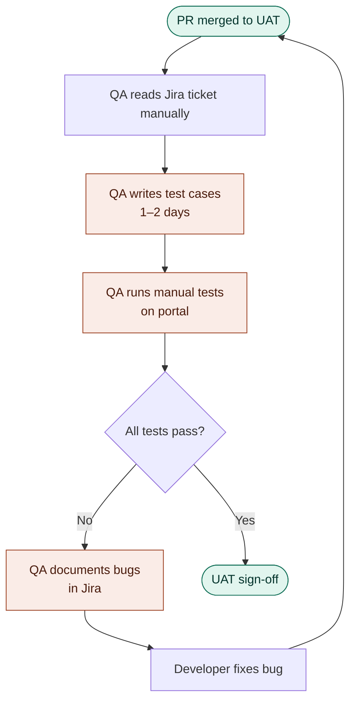
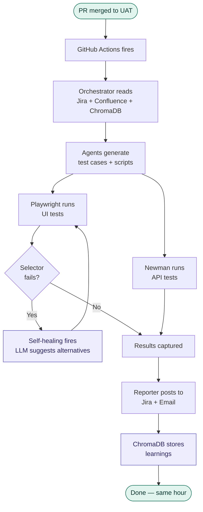
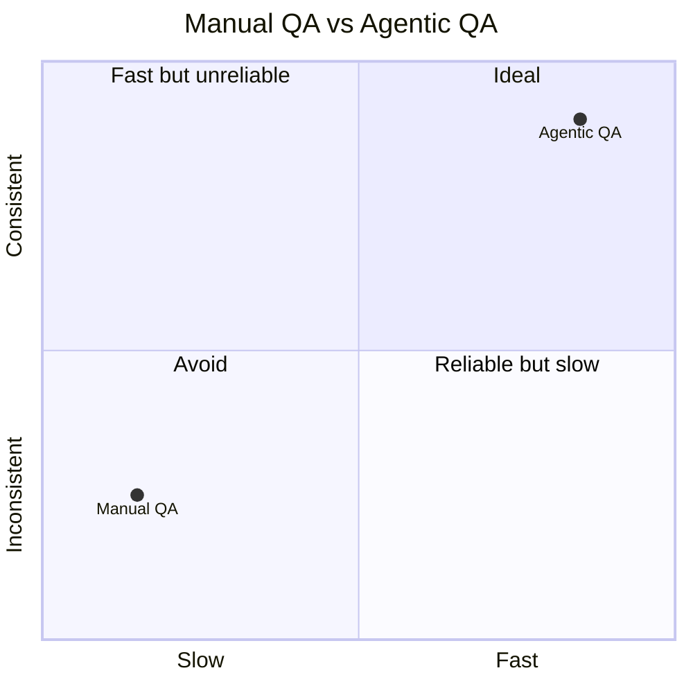
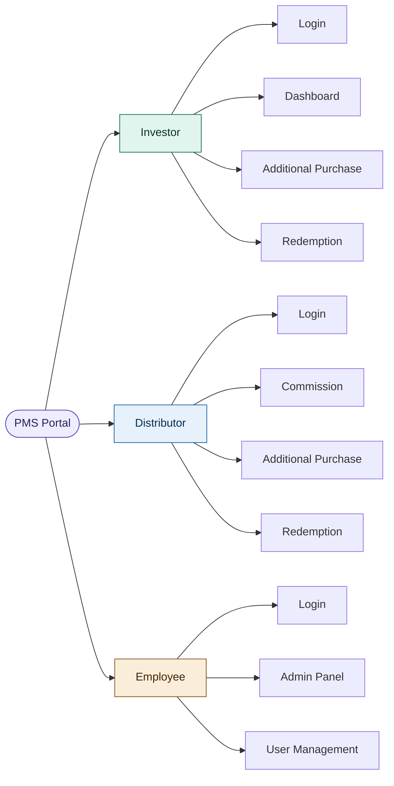
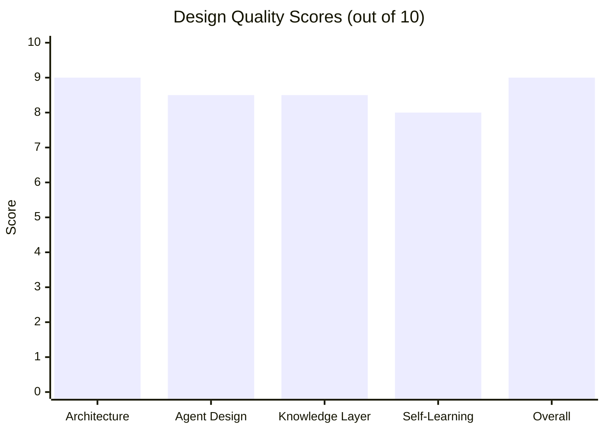

# 01 — System Overview
## Agentic QA Automation System

---

## The Problem — Current Manual Process

**Pain points with this flow:**
- QA testing is a bottleneck — delays every release
- Test cases are inconsistent across QA engineers
- Regression testing is time-consuming and often skipped
- Legacy portal with no `data-testid` attributes makes automation hard
- Knowledge lives in people's heads, not documented systems

---

## The Solution — Agentic QA Pipeline

---

## Before vs After

| Metric | Manual QA | Agentic QA |
|---|---|---|
| Time per ticket | 1–2 days | 4–6 minutes |
| Test consistency | Depends on engineer | Always the same standard |
| Regression coverage | Often skipped | Every run |
| API testing | Rarely done | Every run |
| Self-healing | Manual re-test | Automatic |
| Learning over time | Engineer memory | ChromaDB — persists forever |

---

## User Types Covered

---

## What This System Is NOT

| Not this | Why |
|---|---|
| A no-code tool | Requires an engineer to build and maintain |
| A performance testing tool | Focuses on functional + API correctness |
| A production testing tool | UAT environment only |
| 100% coverage on day one | Coverage grows as recordings and knowledge grow |
| A replacement for developers | Tests code — does not write it |

---

## System Confidence Score

The 9/10 overall score reflects three key decisions that eliminate common failure modes:
recorded selectors (not hallucinated), BE-provided Postman collections (not invented API structures),
and Confluence as a living knowledge base (not static files that go stale).

---

*Next: [02_architecture.md](./02_architecture.md) — Full system architecture*
