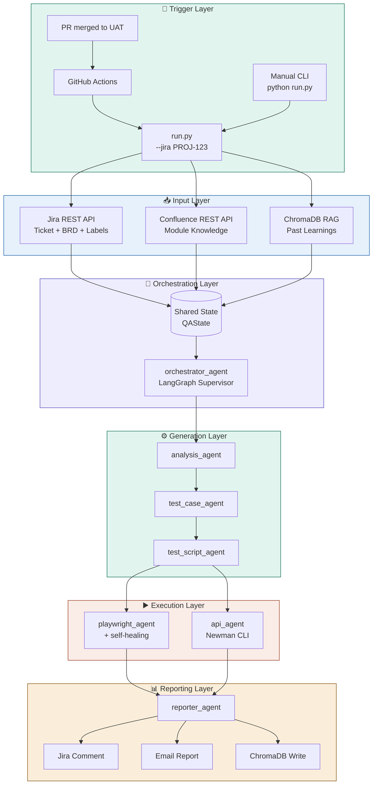
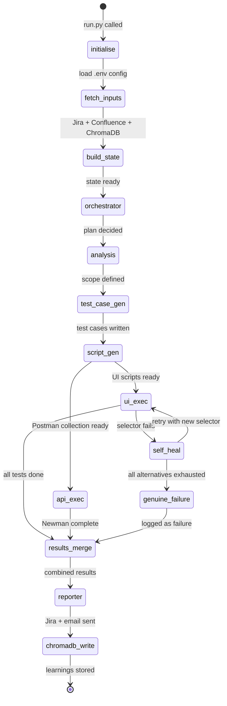
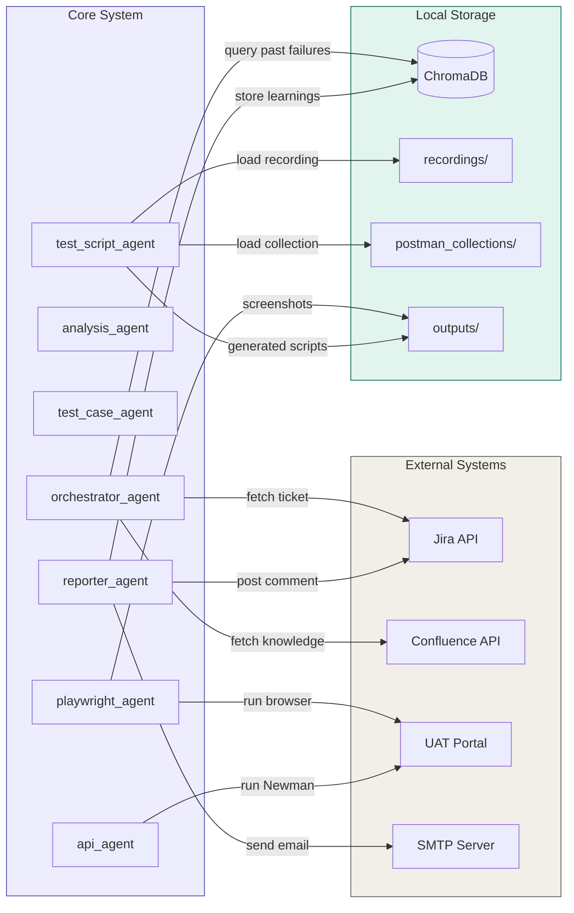
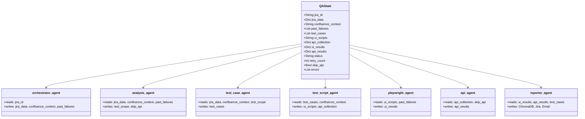
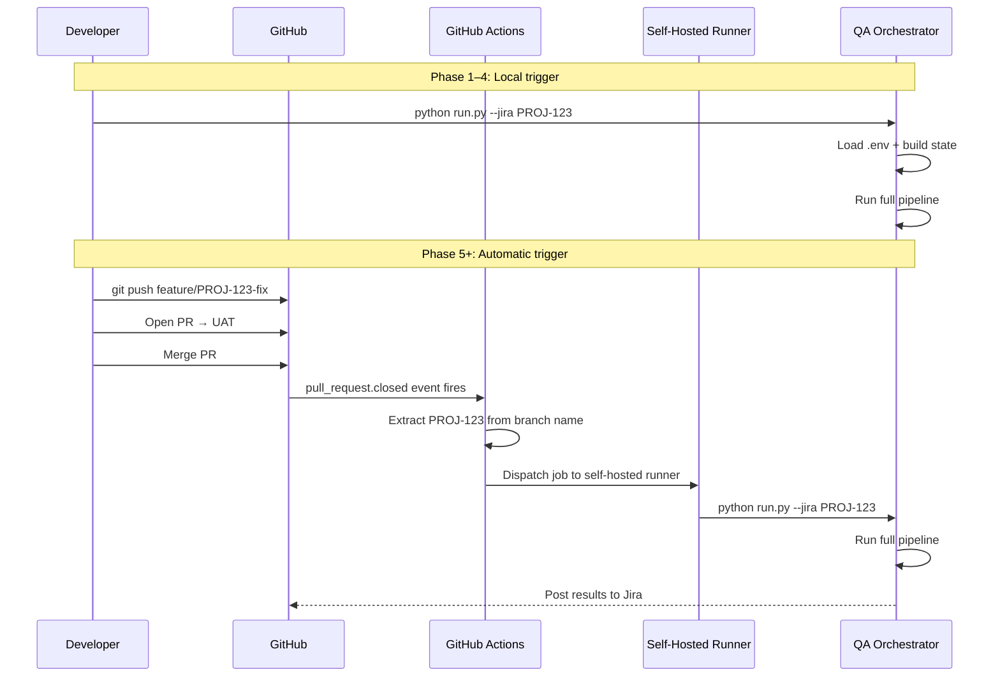
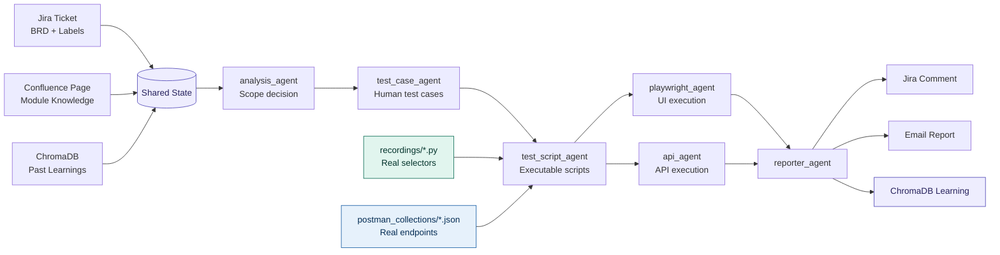

# 02 — System Architecture
## Agentic QA Automation System

---

## High-Level System Architecture

---

## LangGraph State Machine

---

## Component Relationships

---

## LangGraph Shared State Object

---

## Trigger Flow — Local vs Server

---

## Data Flow Summary

---

*Next: [03_agents.md](./03_agents.md) — All 7 agents in detail*
