# 03 — Agent Specifications
## Agentic QA Automation System

---

## Agent Roster

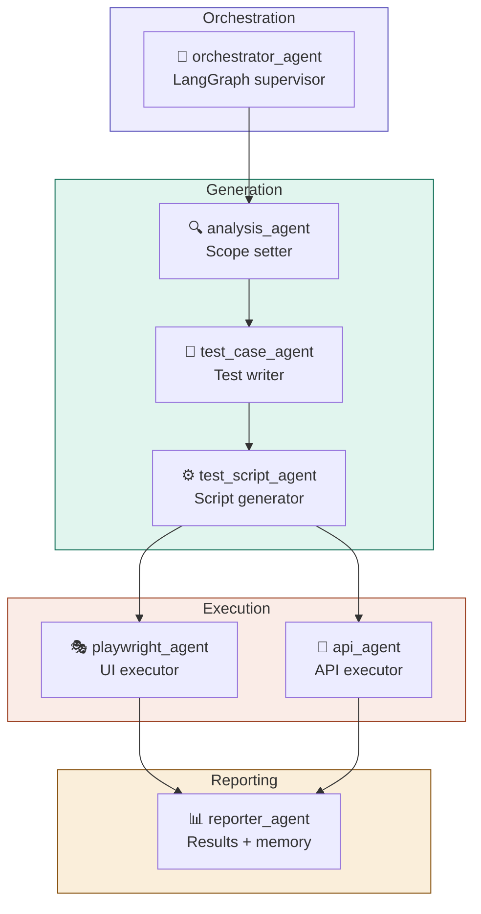

---

## Agent 1 — `orchestrator_agent`

**Role:** Director. Controls the entire pipeline without executing any tests.

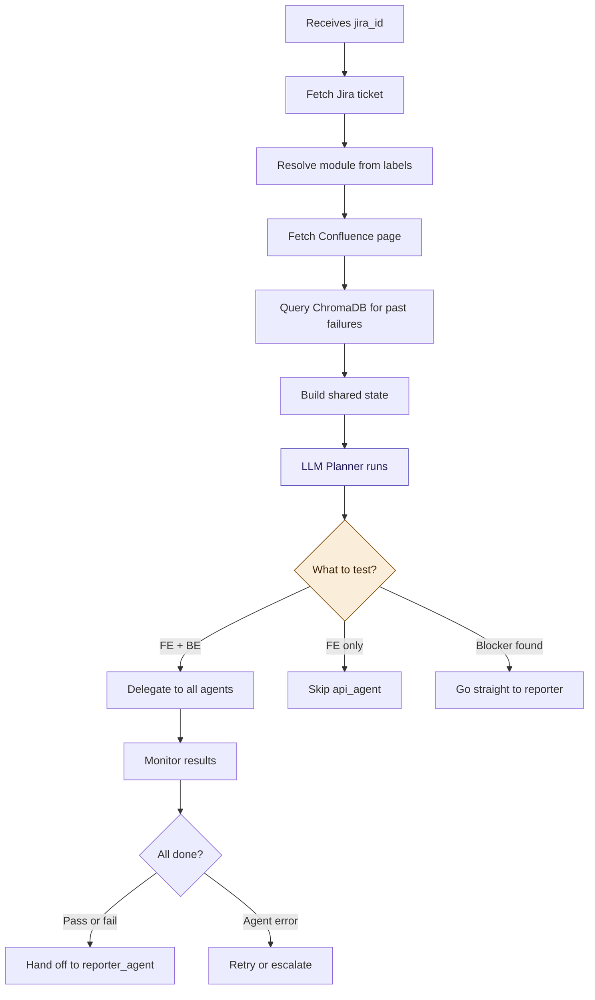

**Key decisions the orchestrator makes:**

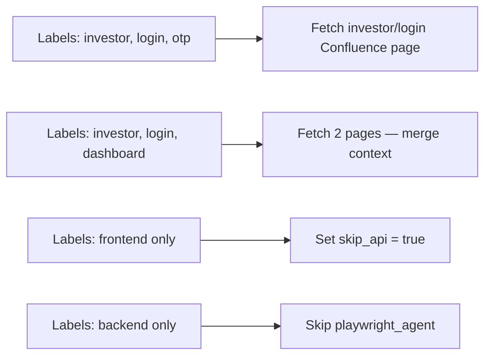

---

## Agent 2 — `analysis_agent`

**Role:** Reads all context and defines exactly what needs testing.

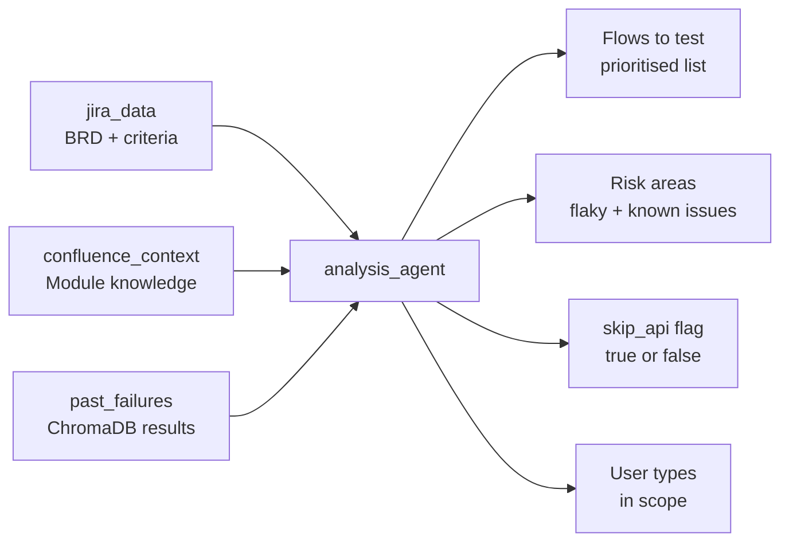

**Output example:**
```
Flows: [standard_login P1, otp_new_device P1, otp_verify P1, otp_expiry P2]
Risk areas: ["OTP screen load slow", "Login button label may change"]
API in scope: true
User types: [retail_investor, institutional_investor]
```

---

## Agent 3 — `test_case_agent`

**Role:** Writes human-readable test cases. No code. Just structured test intent.

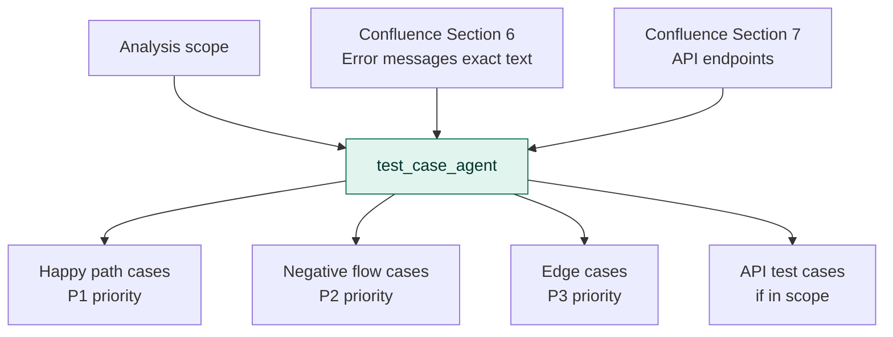

**Test case format:**
```
TC-001 | Standard investor login | P1
Given:  User is on /investor/login
When:   Valid email + password entered → Login clicked
Then:   Redirected to /investor/dashboard
And:    Welcome banner visible
And:    Session token set in cookies
```

---

## Agent 4 — `test_script_agent`

**Role:** Converts test cases into executable code using real baselines — never invents selectors.

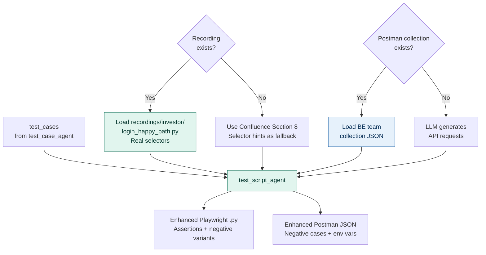

**What the LLM adds on top of recordings:**

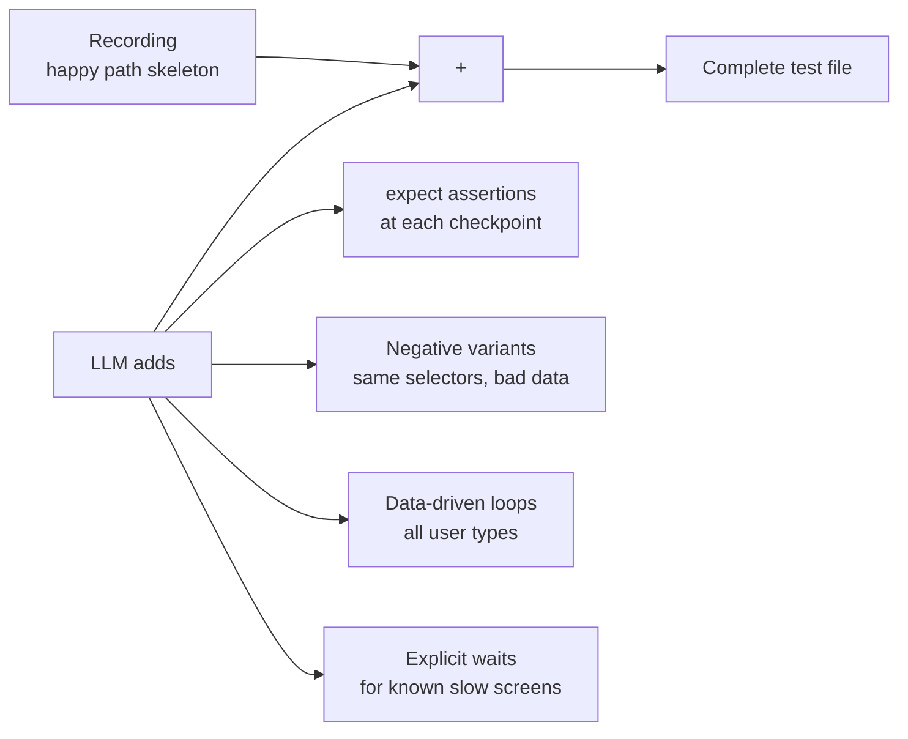

---

## Agent 5 — `playwright_agent`

**Role:** Runs UI tests with an internal self-healing subgraph for broken selectors.

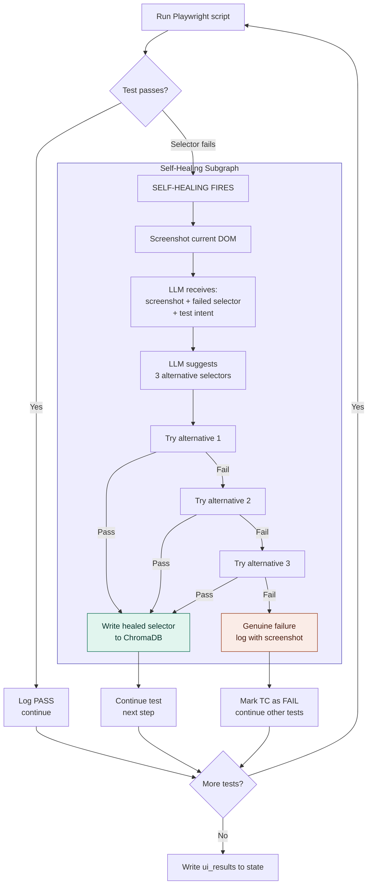

**Result states:**

| Status | Meaning |
|---|---|
| `pass` | Test ran and all assertions passed |
| `fail` | Genuine failure — not a selector issue |
| `healed` | Selector fixed automatically — test passed after healing |
| `skip` | Test skipped due to prerequisite failure |

---

## Agent 6 — `api_agent`

**Role:** Runs Newman CLI against BE-provided Postman collections.

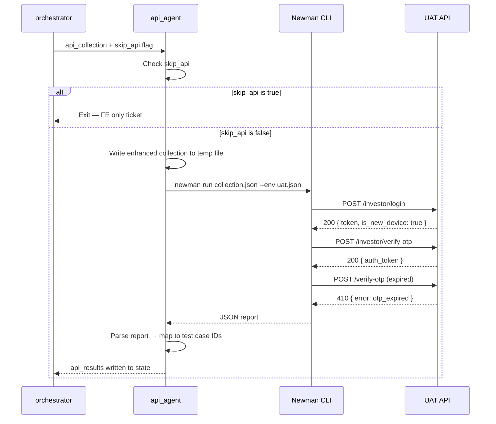

**Why Newman over raw HTTP:**

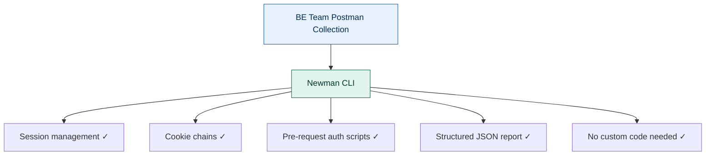

---

## Agent 7 — `reporter_agent`

**Role:** Compiles results, posts to Jira and email, writes learnings to ChromaDB.

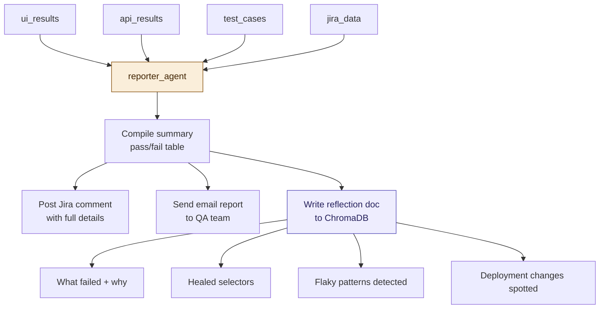

**Jira comment structure:**

```
━━━━━━━━━━━━━━━━━━━━━━━━━━━━━━━━
Agentic QA Report — PROJ-123
━━━━━━━━━━━━━━━━━━━━━━━━━━━━━━━━
UI Tests:  5/5 PASS (1 auto-healed)
API Tests: 3/3 PASS

✅ TC-001  Standard login
✅ TC-002  OTP trigger on new device
✅ TC-003  OTP verification
⚡ TC-004  OTP expiry resend — HEALED
           Original: .otp-resend-btn (broken)
           Healed:   button:has-text("Resend OTP")
✅ TC-005  Invalid OTP error message

API Results:
✅ POST /investor/login        200 OK  (340ms)
✅ POST /investor/verify-otp  200 OK  (280ms)
✅ POST /verify-otp (expired) 410 as expected

No bugs found. Feature ready for UAT sign-off.
━━━━━━━━━━━━━━━━━━━━━━━━━━━━━━━━
```

---

## Agent Communication Pattern

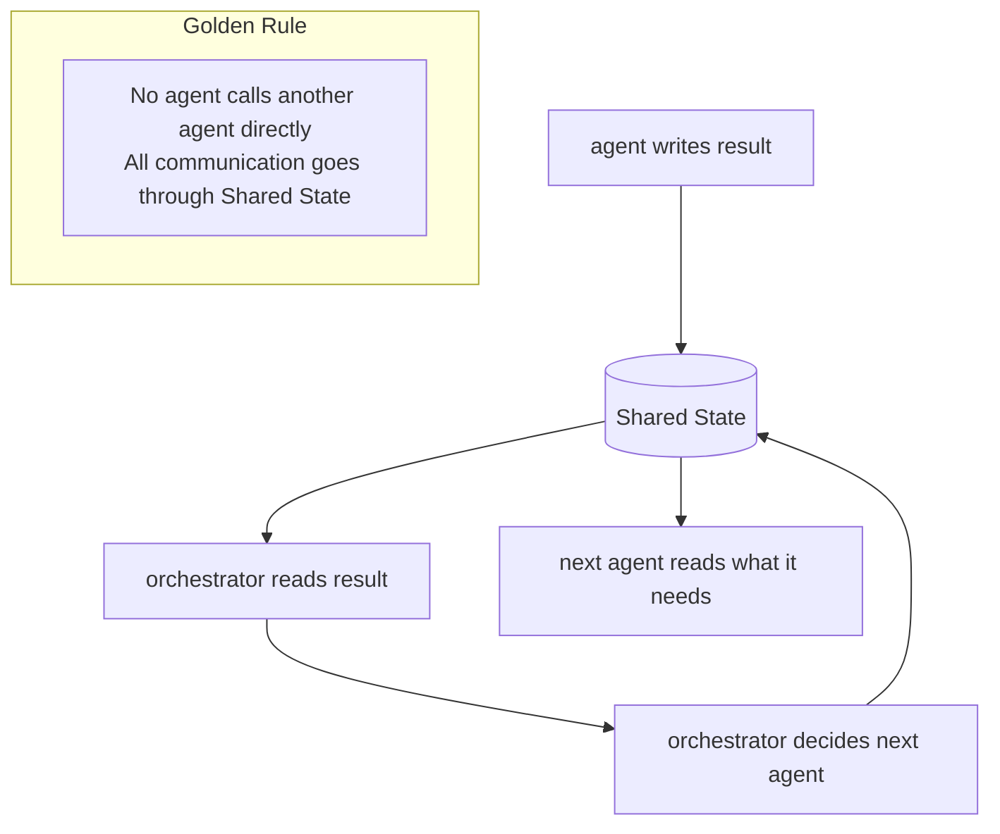

This means every agent can be tested in isolation, failures are contained, and the full state at any point is inspectable for debugging.

---

*Next: [04_workflow.md](./04_workflow.md) — End-to-end workflow walkthrough*
