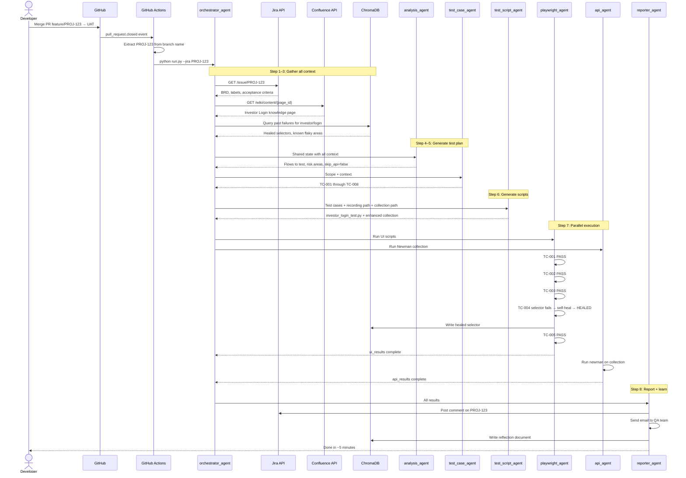
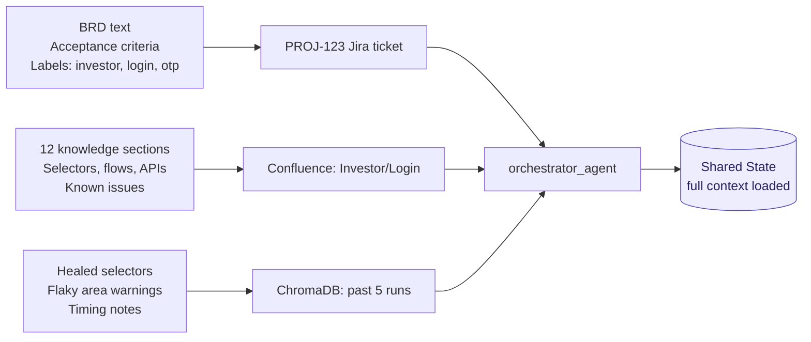
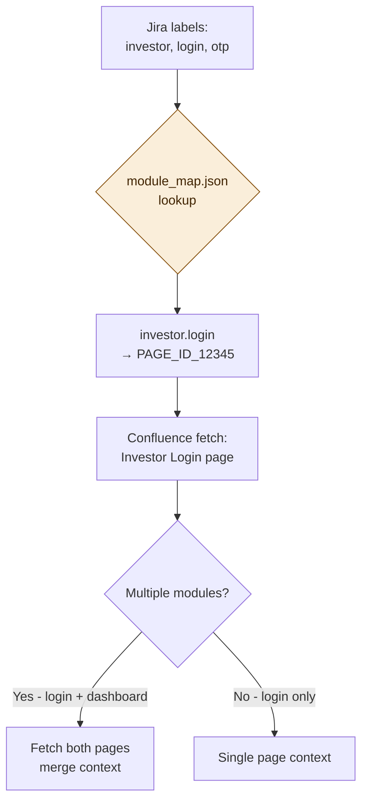
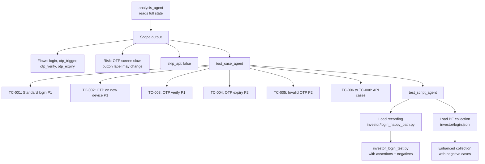
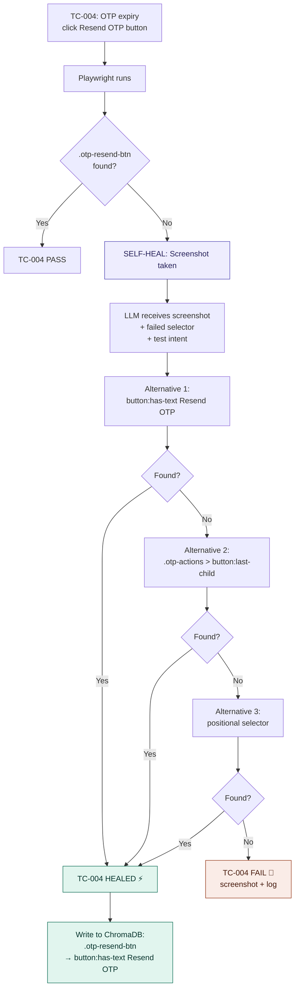
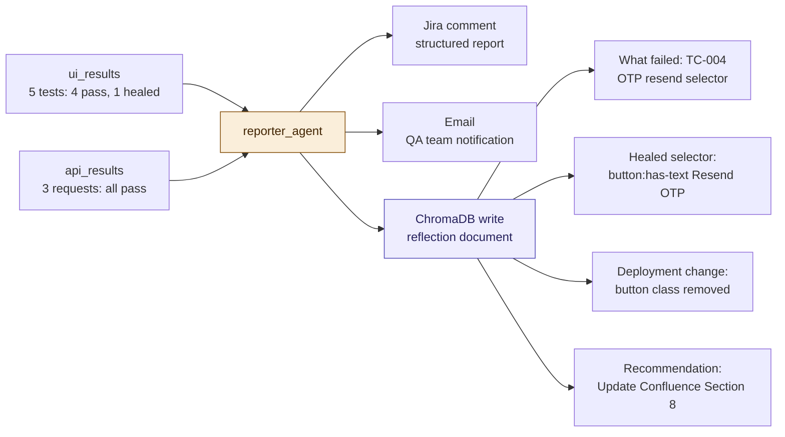
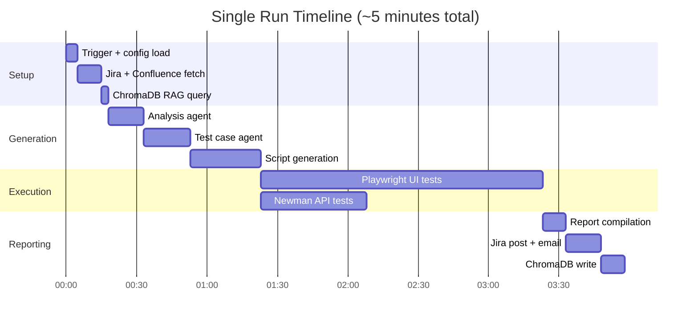
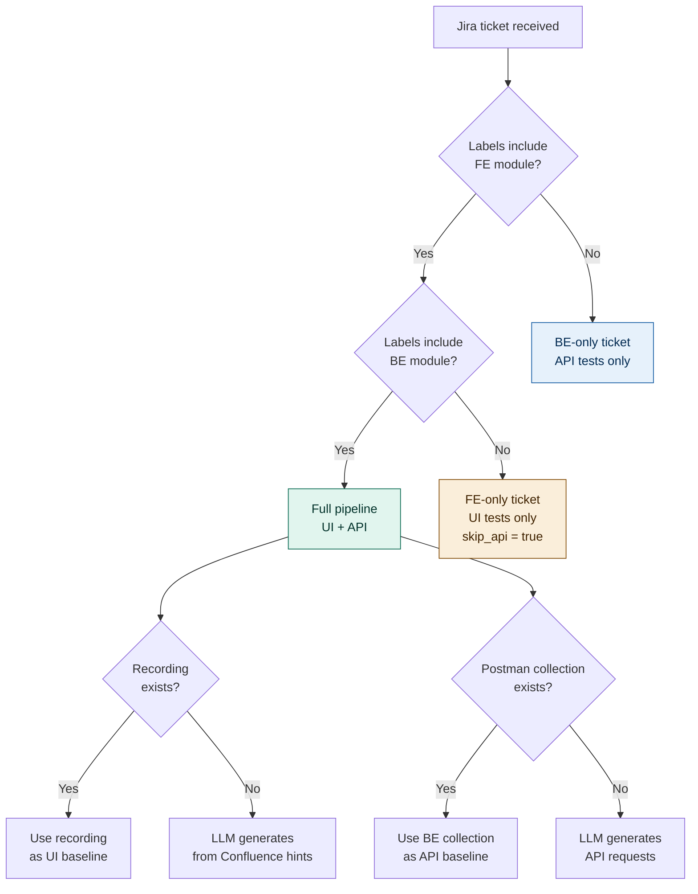

# 04 — End-to-End Workflow
## Agentic QA Automation System

---

## Complete Pipeline — One Diagram

---

## Step-by-Step Breakdown

### Steps 1–3: Context gathering

---

### Step 4: Module resolution

---

### Steps 5–6: Test generation pipeline

---

### Step 7: Execution — self-healing detail

---

### Step 8: Results and learning

---

## Timing Breakdown

---

## Orchestrator Decision Tree

---

*Next: [05_knowledge_layer.md](./05_knowledge_layer.md) — Confluence knowledge base structure*
