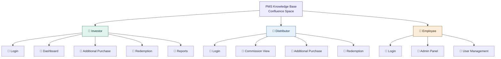
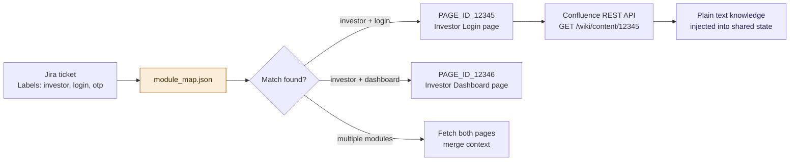
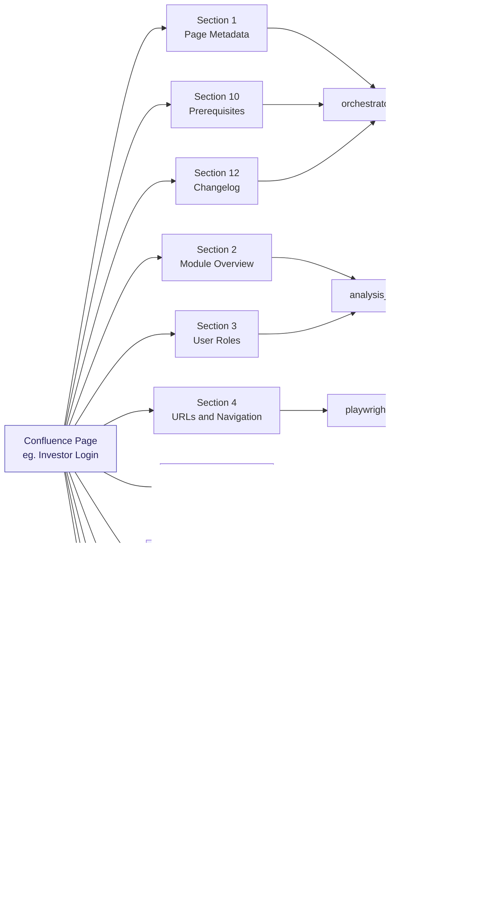
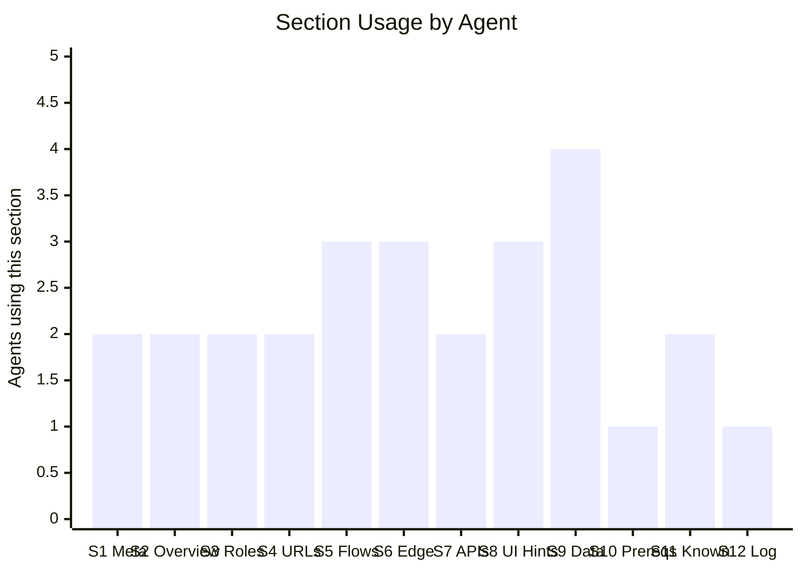
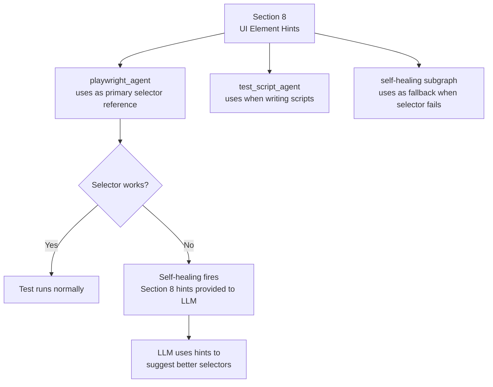
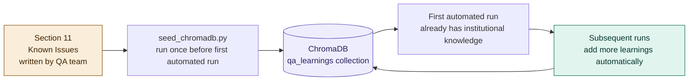
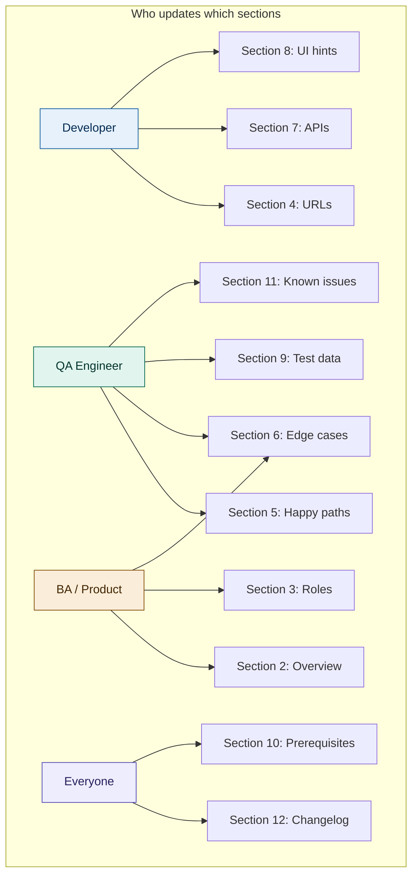
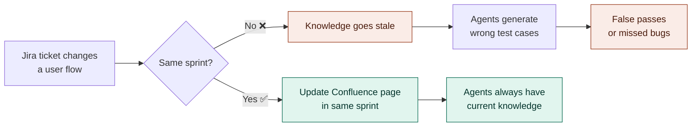

# 05 — Knowledge Layer
## Confluence Knowledge Base Structure

---

## Knowledge Base Structure



---

## How the Orchestrator Finds the Right Page



---

## Page Template — 12 Sections



---

## Which Agent Uses Which Section



| Section | Primary agents |
|---|---|
| 1 — Metadata | `orchestrator_agent` (module routing) |
| 2 — Overview | `analysis_agent`, `test_case_agent` |
| 3 — Roles | `analysis_agent`, `test_case_agent` |
| 4 — URLs | `playwright_agent`, `test_script_agent` |
| 5 — Happy paths | `test_case_agent`, `test_script_agent` |
| 6 — Edge cases | `test_case_agent`, `test_script_agent` |
| 7 — APIs | `api_agent`, `test_script_agent` |
| 8 — UI hints | `playwright_agent`, self-healing subgraph |
| 9 — Test data | `playwright_agent`, `api_agent`, `test_script_agent` |
| 10 — Prerequisites | `orchestrator_agent` |
| 11 — Known issues | Seeds ChromaDB, `playwright_agent` |
| 12 — Changelog | `orchestrator_agent` (confidence check) |

---

## Section 8 — UI Element Hints Detail

This is the most critical section for the legacy portal (no `data-testid`).



**Example Section 8 entry:**
```
Login page elements:
  Email field:    input[name="email"]
  Password field: input[type="password"]
  Login button:   button with text "Login"
                  ⚠️ Changes to "Sign In" after some deployments — try both
  Error toast:    div.error-toast or element containing "Invalid credentials"

OTP page elements:
  OTP input:      input[name="otp"] OR six separate input[type="number"] boxes
                  ⚠️ Layout varies by device — handle both
  Resend button:  button with text "Resend OTP"
                  ⚠️ Class name unreliable — use text selector
  Verify button:  button with text "Verify"
```

---

## Section 11 — Seed Knowledge Flow



---

## Maintenance Responsibility Matrix



---

## The Golden Rule



---

*Next: [06_self_learning.md](./06_self_learning.md) — How the system learns and improves*
