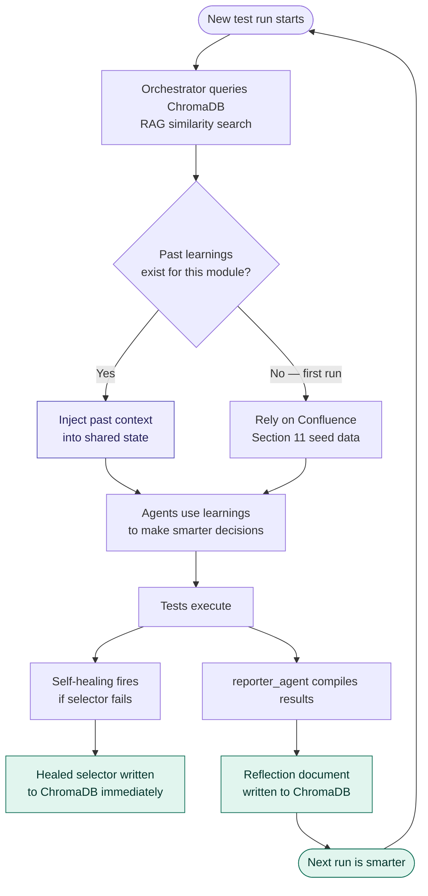
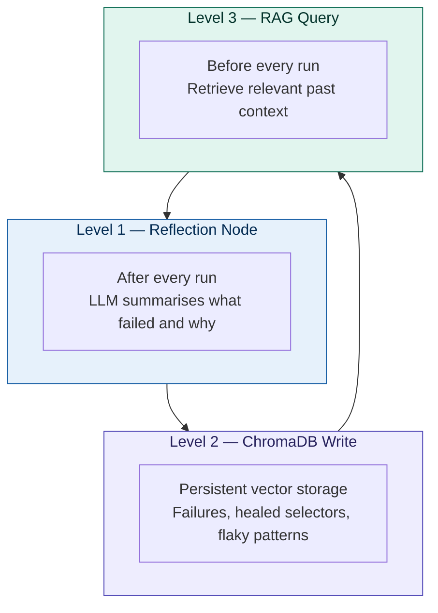
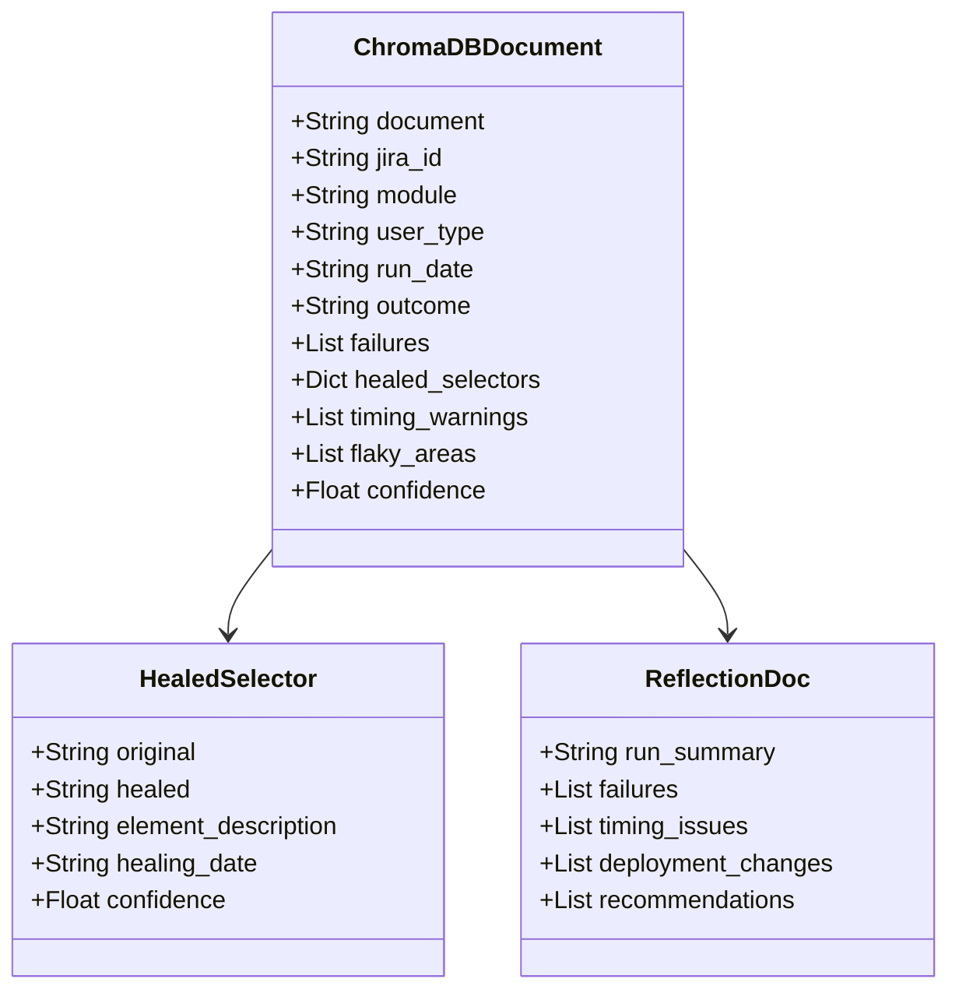
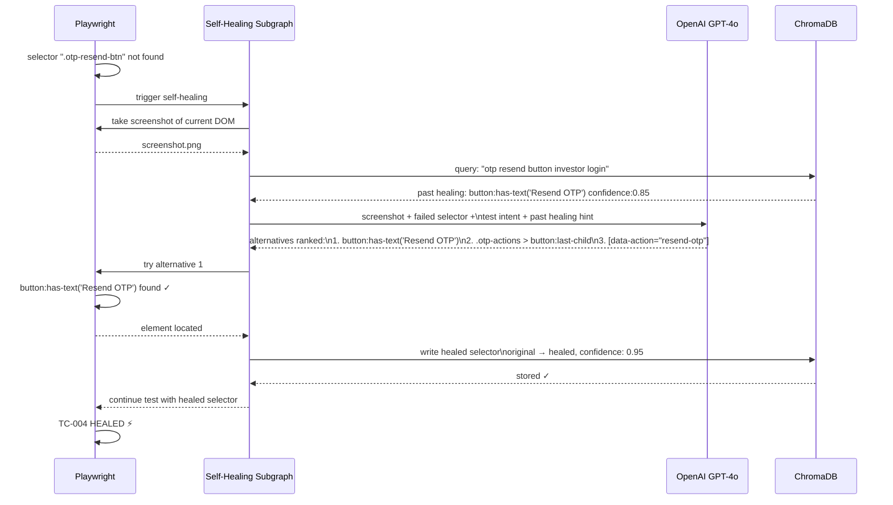
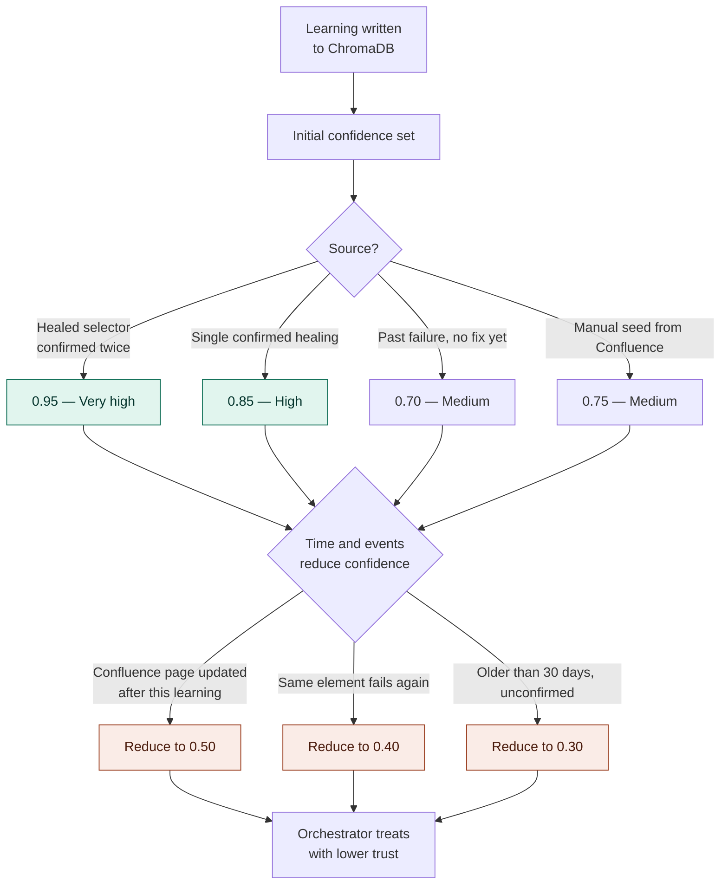
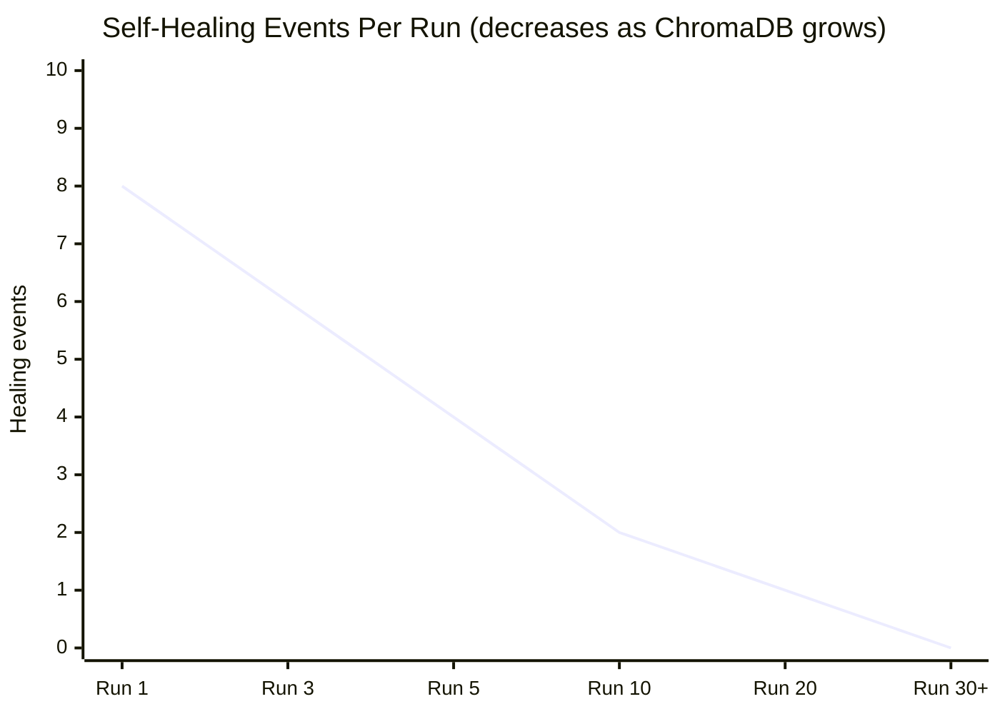
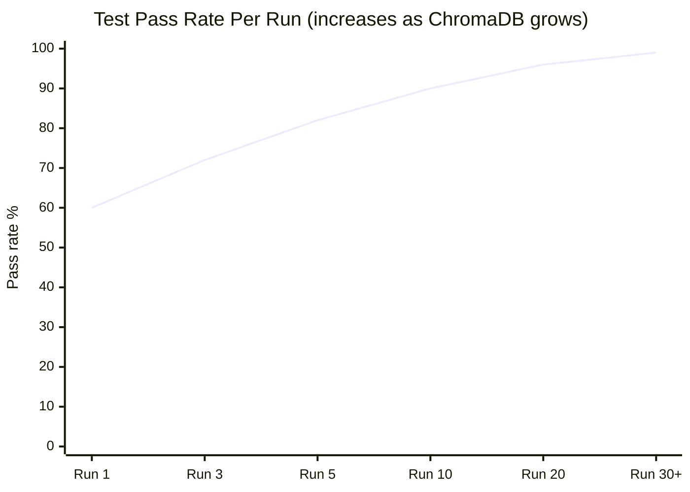
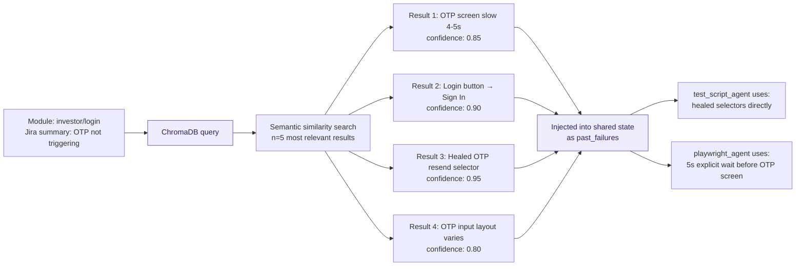
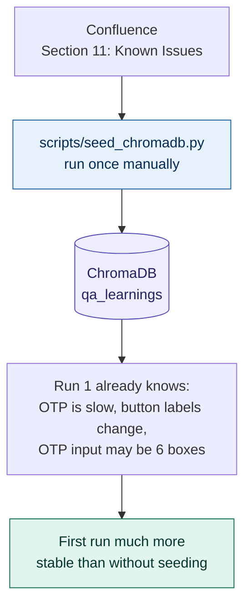
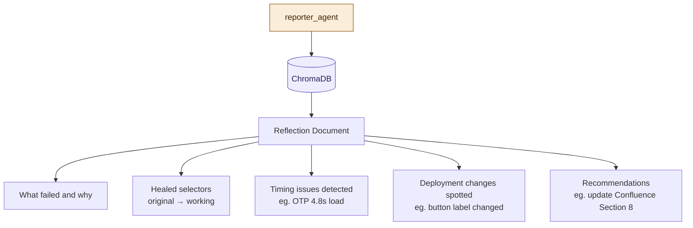

# 06 — Self-Learning System
## ChromaDB Memory and Continuous Improvement

---

## The Learning Loop

---

## Three Levels of Learning

---

## ChromaDB Document Structure

---

## Self-Healing Deep Dive

---

## Confidence Score System

---

## System Intelligence Over Time

---

## RAG Query — What the Orchestrator Asks

---

## Seeding ChromaDB — Before First Run

---

## What Gets Written After Every Run

---

*Next: [07_folder_structure.md](./07_folder_structure.md) — Project folder layout*
