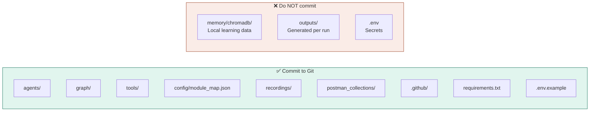
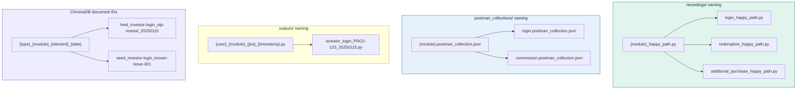

# 07 — Project Folder Structure
## Agentic QA Automation System

---

## Complete Folder Map

```mermaid
graph TD
    ROOT[qa-orchestrator/]

    ROOT --> AGENTS[agents/]
    ROOT --> REC[recordings/]
    ROOT --> PC[postman_collections/]
    ROOT --> CONFIG[config/]
    ROOT --> MEM[memory/]
    ROOT --> OUT[outputs/]
    ROOT --> TOOLS[tools/]
    ROOT --> GRAPH[graph/]
    ROOT --> TESTS[tests/]
    ROOT --> SCRIPTS[scripts/]
    ROOT --> GH[.github/workflows/]
    ROOT --> RUNPY[run.py]
    ROOT --> ENV[.env]
    ROOT --> REQ[requirements.txt]

    AGENTS --> OA[orchestrator_agent.py]
    AGENTS --> AA[analysis_agent.py]
    AGENTS --> TCA[test_case_agent.py]
    AGENTS --> TSA[test_script_agent.py]
    AGENTS --> PA[playwright_agent.py]
    AGENTS --> APIA[api_agent.py]
    AGENTS --> RA[reporter_agent.py]

    REC --> RINV[investor/]
    REC --> RDIST[distributor/]
    REC --> REMP[employee/]
    RINV --> R1[login_happy_path.py]
    RINV --> R2[additional_purchase_happy_path.py]
    RINV --> R3[redemption_happy_path.py]

    PC --> PINV[investor/]
    PINV --> P1[login.postman_collection.json]
    PINV --> P2[additional_purchase.postman_collection.json]

    CONFIG --> MM[module_map.json]
    CONFIG --> PE[postman_environments/]
    PE --> PE1[uat_investor.json]
    PE --> PE2[uat_distributor.json]

    MEM --> CDB[chromadb/]
    CDB --> QL[qa_learnings/]

    GRAPH --> ST[state.py]
    GRAPH --> GB[graph_builder.py]
    GRAPH --> ED[edges.py]

    GH --> YML[qa-trigger.yml]

    style ROOT fill:#EEEDFE,stroke:#534AB7,color:#26215C
    style AGENTS fill:#E1F5EE,stroke:#0F6E56,color:#04342C
    style REC fill:#E1F5EE,stroke:#0F6E56,color:#04342C
    style PC fill:#E6F1FB,stroke:#185FA5,color:#042C53
    style MEM fill:#EEEDFE,stroke:#534AB7,color:#26215C
```



---

## Git Commit Policy



**Add to `.gitignore`:**
```
memory/chromadb/
outputs/
.env
*.pyc
__pycache__/
```

---

## File Naming Conventions



---

## Key File Contents

### `graph/state.py`

```python
from typing import TypedDict, Optional

class QAState(TypedDict):
    # Inputs
    jira_id:             str
    jira_data:           dict      # ticket, BRD, labels, criteria
    confluence_context:  str       # fetched module knowledge
    past_failures:       list      # ChromaDB RAG results

    # Generation outputs
    test_cases:          list      # from test_case_agent
    ui_scripts:          Optional[str]   # enhanced Playwright .py
    api_collection:      Optional[dict]  # enhanced Postman JSON

    # Execution outputs
    ui_results:          Optional[dict]  # pass/fail per test
    api_results:         Optional[dict]  # Newman JSON report

    # Control
    status:              str       # current pipeline state
    retry_count:         int       # self-healing counter
    skip_api:            bool      # true if only FE changed
    errors:              list      # accumulated error log
```

### `config/module_map.json`

```json
{
  "investor": {
    "login":               "CONFLUENCE_PAGE_ID_12345",
    "otp":                 "CONFLUENCE_PAGE_ID_12345",
    "dashboard":           "CONFLUENCE_PAGE_ID_12346",
    "additional-purchase": "CONFLUENCE_PAGE_ID_12347",
    "redemption":          "CONFLUENCE_PAGE_ID_12348"
  },
  "distributor": {
    "login":               "CONFLUENCE_PAGE_ID_22345",
    "commission":          "CONFLUENCE_PAGE_ID_22346"
  },
  "employee": {
    "login":               "CONFLUENCE_PAGE_ID_32345"
  }
}
```

### `.env.example`

```env
JIRA_BASE_URL=https://yourcompany.atlassian.net
JIRA_EMAIL=your.email@company.com
JIRA_API_TOKEN=your_jira_token

CONFLUENCE_BASE_URL=https://yourcompany.atlassian.net
CONFLUENCE_EMAIL=your.email@company.com
CONFLUENCE_API_TOKEN=your_confluence_token

OPENAI_API_KEY=your_openai_key
OPENAI_MODEL=gpt-4o

UAT_BASE_URL=https://uat.yourportal.com

CHROMADB_PATH=./memory/chromadb

SMTP_HOST=smtp.yourcompany.com
SMTP_PORT=587
EMAIL_RECIPIENTS=qa@yourcompany.com
```

---

*Next: [08_tech_stack.md](./08_tech_stack.md) — Technology stack*
