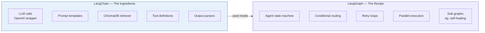
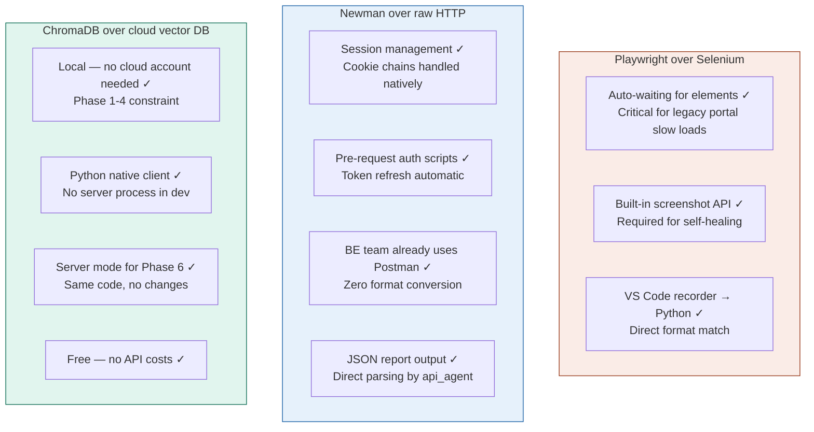
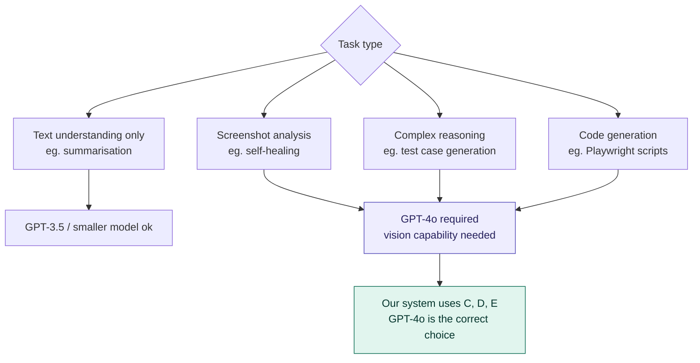
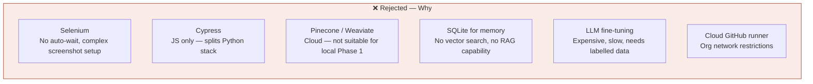
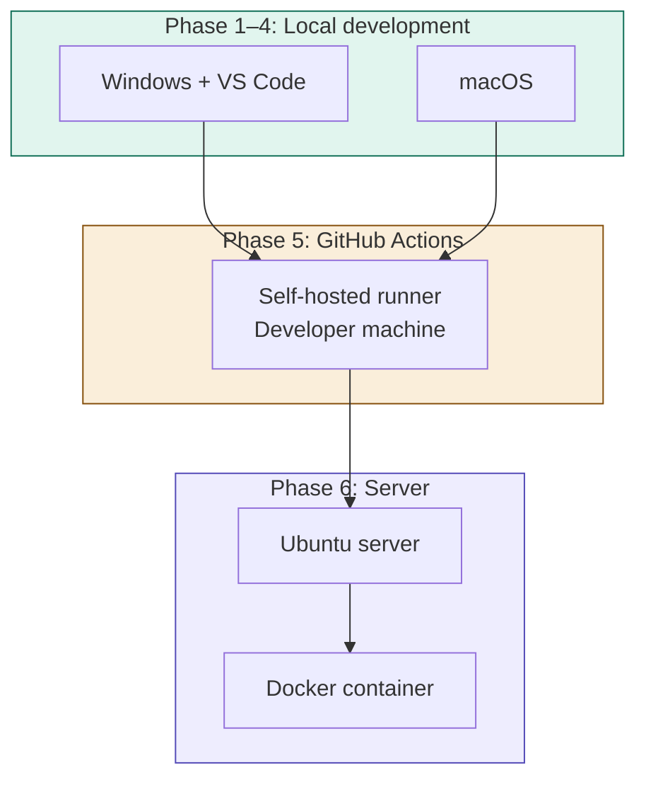

# 08 — Technology Stack
## Agentic QA Automation System

---

## Full Stack Overview

```mermaid
graph TB
    subgraph Orchestration["🧠 Orchestration"]
        LG[LangGraph 0.2.x\nState machine + routing]
        LC[LangChain 0.3.x\nLLM calls + tools]
        OAI[OpenAI GPT-4o\nIntelligence layer]
    end

    subgraph Testing["🎭 Testing"]
        PW[Playwright 1.45.x\nUI browser automation]
        NW[Newman 6.x\nPostman CLI runner]
    end

    subgraph Memory["🧠 Memory"]
        CDB[ChromaDB 0.5.x\nLocal vector database]
    end

    subgraph Integration["🔌 Integration"]
        JA[Jira REST API v3\nTickets + reporting]
        CA[Confluence REST API v2\nKnowledge base]
        SMTP[SMTP\nEmail reporting]
    end

    subgraph Trigger["🚀 Trigger"]
        GHA[GitHub Actions\nAuto-trigger on PR merge]
        SR[Self-Hosted Runner\nInternal network access]
    end

    subgraph Dev["💻 Development"]
        PY[Python 3.11+\nAll agent code]
        VSC[VS Code\nIDE + Playwright recorder]
        COP[GitHub Copilot\nAI-assisted development]
    end

    LG --> LC --> OAI
    PW --> NW
    GHA --> SR

    style Orchestration fill:#EEEDFE,stroke:#534AB7
    style Testing fill:#FAECE7,stroke:#993C1D
    style Memory fill:#E1F5EE,stroke:#0F6E56
    style Integration fill:#E6F1FB,stroke:#185FA5
    style Trigger fill:#FAEEDA,stroke:#854F0B
    style Dev fill:#F1EFE8,stroke:#5F5E5A
```



---

## LangChain vs LangGraph — Why Both



**Rule of thumb:**
- Linear task (summarise this text) → LangChain alone is fine
- Agent that loops, branches, has state, retries → LangGraph is non-negotiable

This system has loops (self-healing retry), branching (skip API if FE only), state (shared QAState), and parallel execution — LangGraph is the correct choice.

---

## Why Each Tool Was Chosen



---

## GPT-4o — Why Not a Cheaper Model



**Cost management:** LLM is only called where reasoning is genuinely needed. Newman execution, ChromaDB writes, and Jira API calls use zero tokens.

---

## What Was Deliberately NOT Chosen



---

## Technology Compatibility



---

## Installation Commands

```bash
# Python dependencies
pip install -r requirements.txt

# Playwright browser
playwright install chromium

# Newman (requires Node.js)
npm install -g newman

# Verify
playwright --version
newman --version
python -c "import langgraph; print('LangGraph OK')"
python -c "import chromadb; print('ChromaDB OK')"
```

---

*Next: [09_phased_delivery.md](./09_phased_delivery.md) — Build phases*
