# 09 — Phased Delivery Plan
## Agentic QA Automation System

---

## Phase Overview

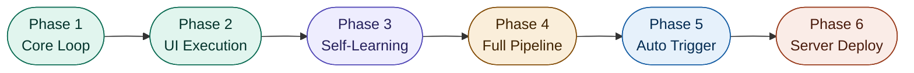

**Golden rule: Get the core loop working before adding features. Each phase is independently valuable.**

---

## Phase 1 — Core Loop

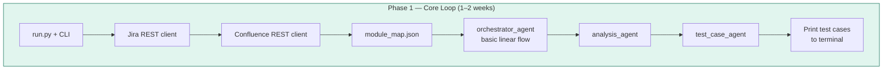

**Validation:**
```bash
python run.py --jira PROJ-123
# Output: list of relevant test cases printed to terminal
```

**Success criteria:** Test cases are relevant to the Jira ticket and reference correct Confluence knowledge.

**What's NOT built yet:** Playwright, API testing, ChromaDB, GitHub Actions

---

## Phase 2 — UI Script Generation and Execution

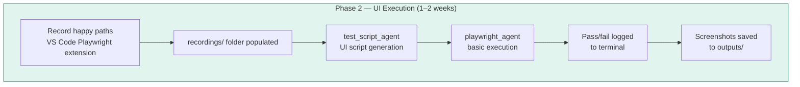

**Validation:** At least 3 test cases run end-to-end without manual intervention.

**What's NOT built yet:** Self-healing, API testing, ChromaDB, reporting

---

## Phase 3 — Self-Healing and ChromaDB Memory

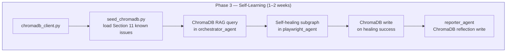

**Validation sequence:**
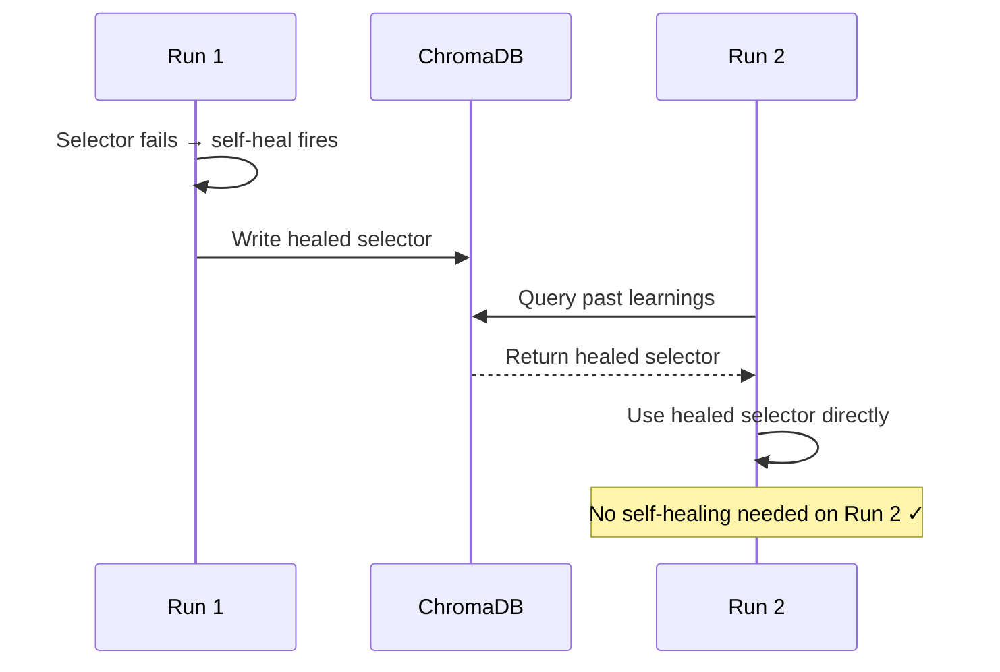

---

## Phase 4 — API Testing and Full Reporting

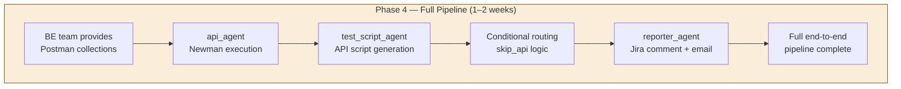

**Validation:** Jira ticket receives structured comment within 6 minutes of triggering. Both UI and API results present.

---

## Phase 5 — GitHub Actions Auto-Trigger

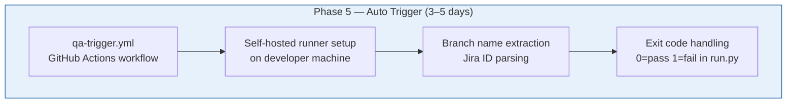

```yaml
# .github/workflows/qa-trigger.yml
name: Agentic QA Trigger
on:
  pull_request:
    types: [closed]
    branches: [uat]

jobs:
  qa-trigger:
    if: github.event.pull_request.merged == true
    runs-on: self-hosted
    steps:
      - name: Extract Jira ID
        run: |
          BRANCH="${{ github.head_ref }}"
          JIRA_ID=$(echo "$BRANCH" | grep -oP '[A-Z]+-[0-9]+')
          echo "jira_id=$JIRA_ID" >> $GITHUB_OUTPUT
      - name: Run QA Orchestrator
        run: python run.py --jira ${{ steps.extract.outputs.jira_id }}
```

---

## Phase 6 — Server Deployment

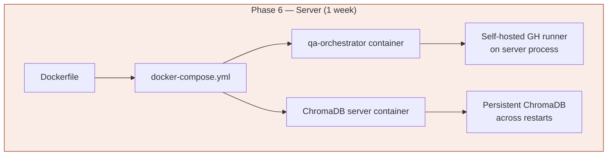

---

## Delivery Timeline

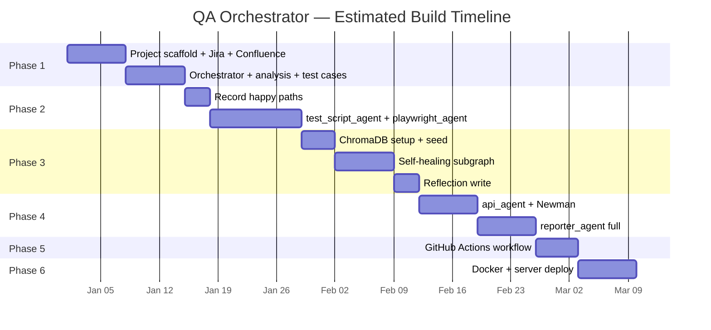

---

## Value at Each Phase

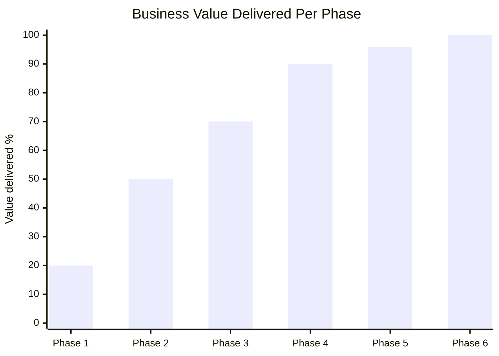

Even Phase 1 + Phase 2 alone is more impressive than most AI engineering portfolio projects. Phase 3 (self-learning) is the differentiating feature that makes this system genuinely novel.

---

## If Time is Limited — Minimum Viable System

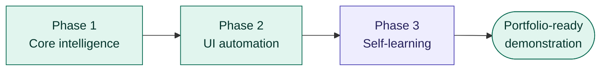

Phases 1–3 in approximately 5 weeks produces a system that: reads Jira tickets, fetches Confluence knowledge, generates test cases, runs Playwright tests, self-heals broken selectors, and grows smarter with every run. That is a complete, demonstrable, senior AI engineering deliverable.

---

*Next: [10_team_conventions.md](./10_team_conventions.md) — Team rules and conventions*
