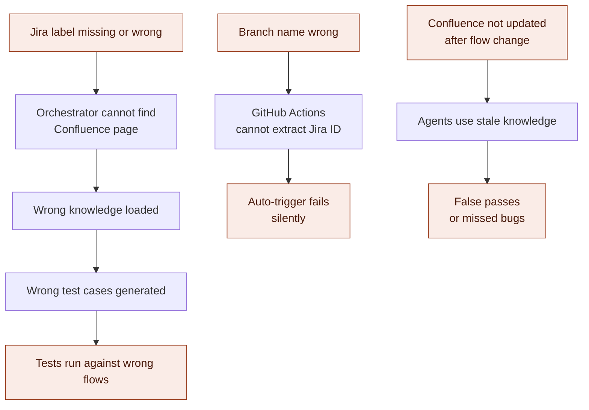
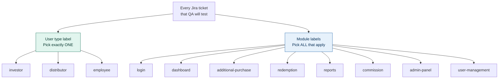
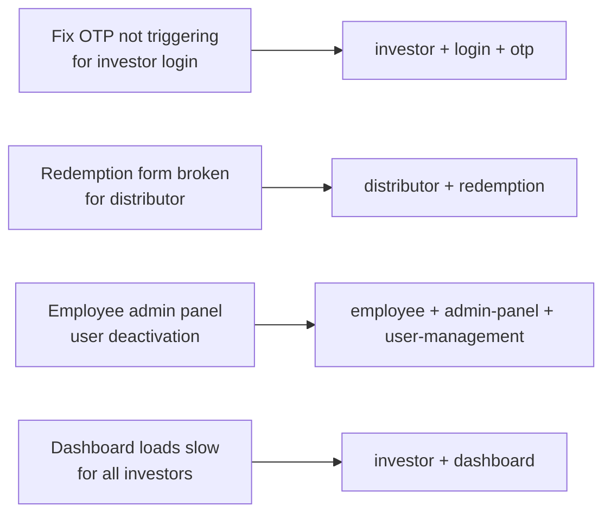
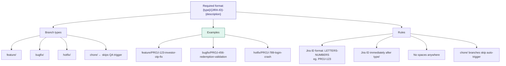
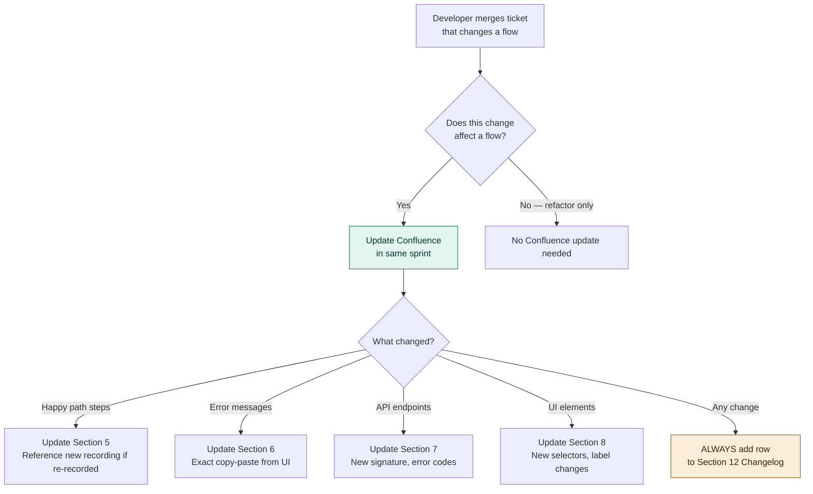
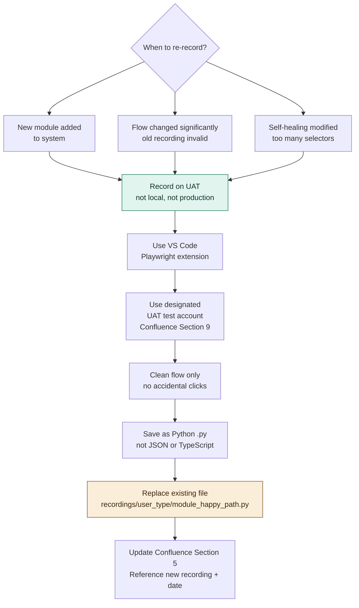
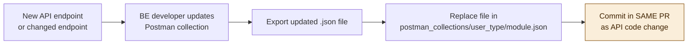
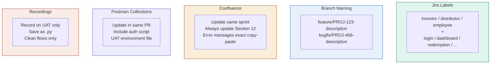

# 10 — Team Conventions
## Agentic QA Automation System

---

## Why These Conventions Matter



These conventions are not suggestions. If they are not followed, the system cannot function correctly.

---

## 1. Jira Label Taxonomy



**Label rules:**
- Lowercase only — `investor` not `Investor`
- Hyphens for spaces — `admin-panel` not `admin panel`
- Every ticket needs at minimum 1 user type + 1 module label
- Tickets with no matching labels are silently skipped by the orchestrator

**Examples:**



---

## 2. Branch Naming Convention



**How GitHub Actions extracts the Jira ID:**
```bash
BRANCH="feature/PROJ-123-investor-otp-fix"
JIRA_ID=$(echo "$BRANCH" | grep -oP '[A-Z]+-[0-9]+')
# Result: PROJ-123
```

If the branch name does not contain a valid Jira ID, the workflow exits with a clear error and posts a comment on the PR.

---

## 3. Confluence Maintenance Rules



**Responsibility matrix:**

| Section | Developer | QA Engineer | BA / Product |
|---|---|---|---|
| 2 — Overview | | | ✅ |
| 3 — Roles | | | ✅ |
| 4 — URLs | ✅ | | |
| 5 — Happy paths | | ✅ | |
| 6 — Edge cases | | ✅ | ✅ |
| 7 — APIs | ✅ | | |
| 8 — UI hints | ✅ | ✅ | |
| 9 — Test data | | ✅ | |
| 10 — Prerequisites | ✅ | | |
| 11 — Known issues | | ✅ | |
| 12 — Changelog | ✅ | ✅ | ✅ |

---

## 4. Recording Conventions



---

## 5. BE Team Postman Collection Rules



**Checklist for each Postman collection:**
- [ ] All endpoints for the module included (not just happy path)
- [ ] Pre-request script for authentication (token fetch)
- [ ] At least one test assertion per request (status code minimum)
- [ ] UAT environment file provided with `{{base_url}}` and `{{auth_token}}`
- [ ] Variables used consistently — no hardcoded UAT URLs in requests

---

## Quick Reference Card



---

## Convention Compliance Checklist — Before Merging Any PR

```
PR Checklist for QA Orchestrator Compatibility

[ ] Jira ticket has at least one user type label (investor / distributor / employee)
[ ] Jira ticket has at least one module label (login / redemption / etc.)
[ ] Branch name follows format: {type}/{JIRA-ID}-{description}
[ ] If flow changed → Confluence page updated in this sprint
[ ] If Confluence updated → Section 12 Changelog has new row
[ ] If API changed → Postman collection updated and committed in this PR
[ ] If happy path changed → New recording made and committed
[ ] No production credentials anywhere in the codebase
[ ] .env not committed (check .gitignore)
```

---

*This completes the QA Orchestrator documentation set.*

*Contact: Dhiraj Prajapati — TechStalwarts Software Development LLP*
