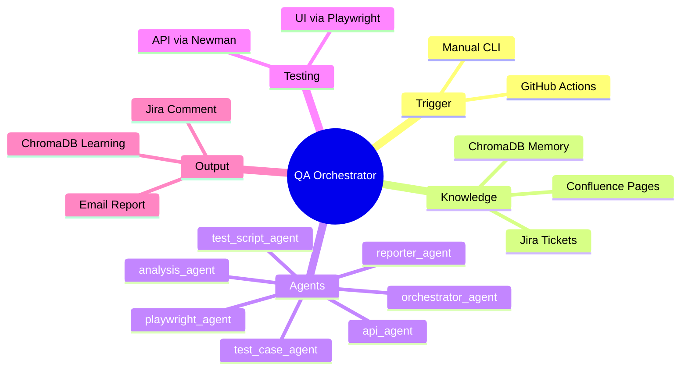
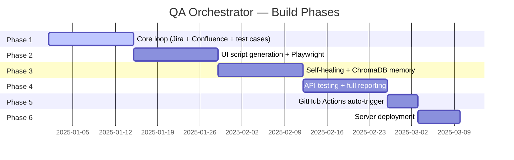

# Agentic QA Automation System
## Documentation Index

> A fully agentic QA orchestration system that replaces manual testing with intelligent, self-learning agents. Built on LangGraph, LangChain, Playwright, and OpenAI.

---

---

## Document Index

| # | Document | Audience | Description |
|---|---|---|---|
| 1 | [01_overview.md](./01_overview.md) | Everyone | What the system is, why it exists, what it replaces |
| 2 | [02_architecture.md](./02_architecture.md) | Tech leads, Developers | Full system architecture and component relationships |
| 3 | [03_agents.md](./03_agents.md) | Developers | All 7 agents — responsibilities, inputs, outputs |
| 4 | [04_workflow.md](./04_workflow.md) | Everyone | End-to-end workflow from PR merge to Jira report |
| 5 | [05_knowledge_layer.md](./05_knowledge_layer.md) | QA, BA, Product | Confluence knowledge base structure and maintenance |
| 6 | [06_self_learning.md](./06_self_learning.md) | Tech leads, Developers | How the system learns and improves over time |
| 7 | [07_folder_structure.md](./07_folder_structure.md) | Developers | Project folder layout and file naming conventions |
| 8 | [08_tech_stack.md](./08_tech_stack.md) | Tech leads, Developers | Full technology stack with justifications |
| 9 | [09_phased_delivery.md](./09_phased_delivery.md) | Everyone | Build phases from local prototype to production |
| 10 | [10_team_conventions.md](./10_team_conventions.md) | Everyone | Jira labels, branch naming, Confluence maintenance rules |

---

## Quick Summary

**Problem:** Manual QA testing is slow, inconsistent, and does not scale with delivery speed.

**Solution:** An agentic orchestrator that reads a Jira ticket, fetches module knowledge from Confluence, generates test cases, runs UI and API tests, self-heals broken selectors, and reports findings — all without human intervention.

| Capability | Detail |
|---|---|
| Testing types | Functional UI (Playwright) + API (Newman) |
| Self-learning | ChromaDB — every run smarter than the last |
| Knowledge source | Confluence REST API — fetched dynamically |
| Trigger | GitHub Actions on PR merge to UAT |
| Portal support | Legacy portals with no data-testid attributes |

---

## Current Build Status

---

*Maintained by: Dhiraj Prajapati — TechStalwarts Software Development LLP*
